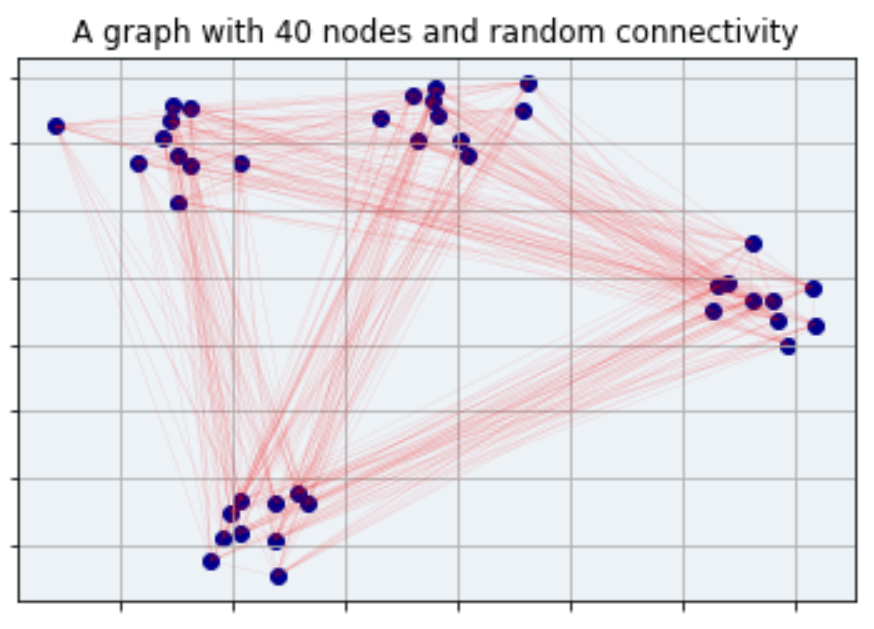
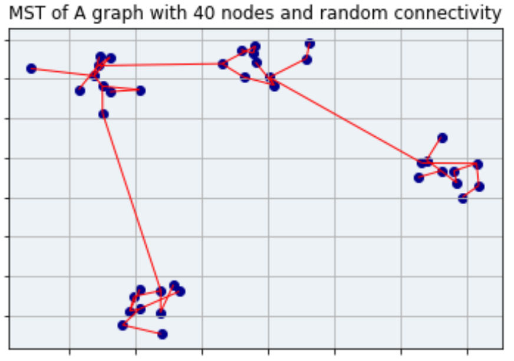

# PyCuda Implementations of Optimization Algorithms (in progress)

Optimization algorithms have to be rewritten, not only code-wise, but method-wise. An algorithm that works O(n) time but has no operation that can be parallelized may perform worse than an algorithm that works in O(nlogn) time but has an extremely parallelizable step when implemented on a GPU.

This means that most of the optimization algorithms must be revisited for proper GPU speedup to occur. Also consider that it is easier to get a GPU with more cores than it is to increase clock speed on a CPU, further pressing the feasibility of parallel algorithms versus linear algorithms.

## Topics (in progress)
1) Minimum Spanning Tree (useful for clustering)

Example of a random graph with 4 clusters (from clustering-with-mst/parallel_implementation.ipynb)
### Graph

### Minimum Spanning Tree of Graph

From here, a method of cutting edges over a certain changing threshold which increases at every step, can form clusters.
